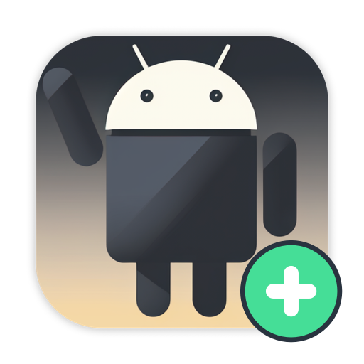

<div align="center">
  <a href="https://cnb.cool/scrmoa/other/aya/-/releases" target="_blank">
    
  </a>
</div>

<h1 align="center">AYA-Plus</h1>

<div align="center">

[English](README.md) | [简体中文](README.zh-CN.md)

</div>

<div align="center">

AYA-Plus Android ADB desktop app.

[![Windows][windows-image]][release-url]
[![macOS][mac-image]][release-url]
[![Linux][linux-image]][release-url]
![License][license-image]

</div>

[windows-image]: https://img.shields.io/badge/-Windows-blue?style=flat-square&logo=windows
[mac-image]: https://img.shields.io/badge/-macOS-black?style=flat-square&logo=apple
[linux-image]: https://img.shields.io/badge/-Linux-yellow?style=flat-square&logo=linux
[release-url]: https://cnb.cool/scrmoa/other/aya/-/releases
[license-image]: https://img.shields.io/github/license/aa24615/aya?style=flat-square


[AYA-Plus](https://github.com/aa24615/aya) is an enhanced fork of [AYA](https://aya.liriliri.io/) for managing and controlling Android devices through a visual ADB interface.

## Installation

Open the [AYA-Plus Releases](https://cnb.cool/scrmoa/other/aya/-/releases) page to download an installer. Windows x64, Mac arm64, Mac x64 and Linux x86_64 are supported.

## Features


* Screen mirror
* File explorer
* Application manager
* Process monitor
* Layout inspector
* CPU, memory and FPS monitor
* Logcat viewer
* Interactive shell
* Custom device name and remark
* Device list import and export in CSV format
* Device table/card views with batch screenshot refresh

Device cards use a fixed-height horizontal layout with complete device
metadata on the left and the latest thumbnail on the right. Selecting a card
shows the full screenshot in the resizable pane on the right.

## Device Metadata and CSV

The device manager keeps the ADB-reported model and adds two editable fields: **Device Name** and **Remark**. Select a device and click **Edit** to update these fields. Metadata is stored locally and is associated with the device serial number when available.

Use **Export CSV** to create a complete backup of the current device list. For batch network-device import, use these four columns:

```text
Device Name,IP Address,Port,Remark
Front Desk,192.168.1.10,5555,First-floor lobby
```

AYA-Plus combines the IP address and port, attempts `adb connect`, and then reads the model, serial number, Android version, and SDK version from every connected device. Failed connections remain available as offline remote devices with their imported name and remark. Devices must already have ADB TCP enabled or be paired for wireless debugging; the CSV port is the connection port, not the pairing port.

The complete export format remains supported for backup and re-import:

```text
ID,Serialno,Model,Device Name,Remark,Android Version,SDK Version,Status
```

CSV files with English or Chinese headers, UTF-8 BOM, quoted commas, and multiline remarks are supported. IPv4 addresses and ports from 1 to 65535 are accepted. See the [Chinese documentation](README.zh-CN.md#设备名称备注与-csv-管理) for detailed instructions.

For more detailed usage instructions, refer to the [upstream AYA documentation](https://aya.liriliri.io).

## Related Projects

* [licia](https://github.com/liriliri/licia): Utility library used by AYA-Plus.
* [luna](https://github.com/liriliri/luna): UI components used by AYA-Plus.
* [vivy](https://github.com/liriliri/vivy): Icon image generation.
* [echo](https://github.com/liriliri/echo): Harmony OS device-management project.

## Contribution

Read the upstream [Contributing Guide](https://aya.liriliri.io/guide/contributing.html) for development setup instructions.

## Brand Assets

AYA-Plus keeps the original application ID, Android helper protocol, and `AYA` user-data directory so existing installations retain their device names, remarks, remote devices, and settings. The **Check for Updates** menu opens this project's Releases page instead of the upstream AYA feed. On macOS, run `npm run gen:app-icon` to regenerate all committed Plus icon assets from the preserved source artwork.
